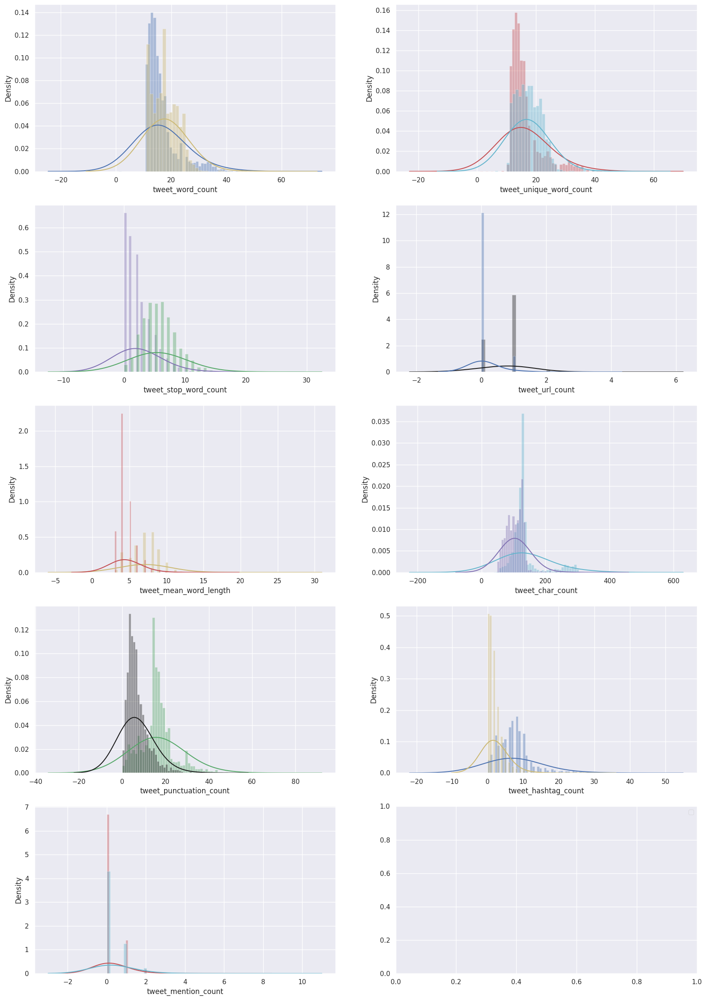

# Twitter-Sentiment-Analysis
•	For code go to [Notebooks](https://github.com/m-nosrati/Twitter-Sentiment-Analysis/tree/main/notebooks)

•	For raw data go to [Data](https://github.com/m-nosrati/Twitter-Sentiment-Analysis/tree/main/Data)

•	Full [Report]()

•	Presentation [Slides](https://github.com/m-nosrati/Twitter-Sentiment-Analysis/blob/main/Final%20Capstone%20Presentation..pdf)

# Problem Statement

▪ The problem in sentiment analysis is classifying the
polarity of a given tweet or text regarding any service,
product, or company, whether the expressed opinion in
the tweet is positive or negative. 

# Context

For this project tweets from customers about various tech firms who manufacture and sell mobiles, computers, laptops, etc. which are available for public use will be used. 

The dataset contains a test and train dataset. Dataset details:

### Test dataset:

ID: The id of the tweet (9873)

tweet: the text of the tweet (Most viewed this week)

### Train dataset:

ID: The id of the tweet (9873)

label: 0-positive and 1-negative

tweet: the text of the tweet (Most viewed this week)
source of [dataset](https://www.kaggle.com/sureshmecad/identify-the-sentiments-analytics-vidhya?select=train.csv)

# Goal

Four different machine learning classification models will be used to analyze the text dataset.
performance metrics will be used to choose the best performer model to use to classify the text as positive or negative. 

# Method
Sentiment Analysis is a very frequent term within text classification and is essentially to use natural language processing (quite often referred simply as NLP)+ machine learning to interpret and classify emotions in text information.

Sentiment analysis of the tweets for this project has been done with three models such as basic logistic regression, LSTM, and AutoNLP. 
To pick the best performing model the performance metrics of each model with train and test datasets has been used. 

# Exploratory Data Analysis (EDA)

#
# Modeling
•	logistic regression: logistic regression is one of the most important analytic tools in the social and natural sciences. In natural language processing, logistic regression is the baseline supervised machine learning algorithm for classification and has a very close relationship with neural networks.

	         •	To perform a logistic regression after tokenizing, cleaning/preprocessing text dataset such as removing punctuations, emoji’s, stopwords, HTML tags, and lemmatization. The text has been vectorized by using Bag of words and TF-IDF methods and then run the model.

•	 Long Short-Term Memory networks: Long Short-Term Memory networks – usually just called “LSTMs” – are a special kind of RNN, capable of learning long-term dependencies. LSTMs are explicitly designed to avoid the long-term dependency problem. Remembering information for long periods of time is practically their default behavior, not something they struggle to learn! The LSTM model performed after cleaning/ preprocessing, encoding and word embedding the text dataset. 

•   AutoNLP: Auto training and fast deployment for state-of-the-art NLP models. AutoNLP is an automatic way to train, evaluate and deploy state-of-the-art NLP models for different tasks. Using AutoNLP, you can leave all the worries of selecting the best model, fine-tuning the model, or even deploying the models and focus on the broader picture for your project/business. After installing the packages and uploading the dataset it was ready to run the model.

